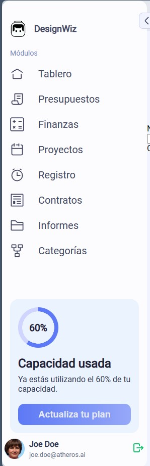
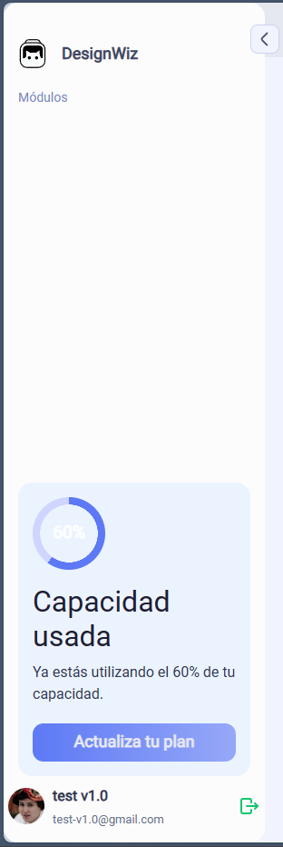
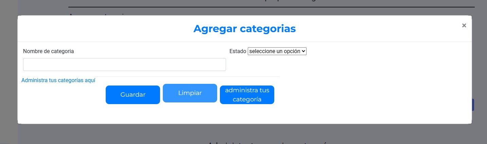

# DesignWiz
Plataforma de gestión integral para freelancers de diseño gráfico. Genera presupuestos, factura, realiza seguimiento financiero, administra proyectos, registra tiempo y gastos, comunícate con clientes y mantén un control total de tus finanzas. Herramientas de eficiencia y profesionalismo para diseñadores gráficos independientes.

## v1.0.0 10/11/23

### bugs
- Menu

inicialmente trabaje con el documento en formato .html al pasarlo a .php desaparecio el color de los elementos tristemente no pude resolverlo

### Problemas Conocidos (Bugs)

- **Menú:**
 
| Mal | Bien |
|----------|----------|
|   | |

Inicialmente, trabajé con el documento en formato `.html`. Sin embargo, al pasarlo a `.php`, noté que el color de los elementos del menú desapareció. Lamentablemente, no logré resolver este problema.

### Mejoras en el Sitio

Se ha agregado un formulario emergente que está disponible en cualquier momento, independientemente del módulo en el que te encuentres. Esta adición se realizó considerando la necesidad constante de añadir una categoría presupuestal en cualquier momento.

## Notas para Visualizar o Instalar

Si bien algunos pueden querer descargarlo, es importante tener en cuenta la base de datos. Para facilitar la replicación de la página, se proporciona un respaldo de la base de datos (`back_app.sql`). Esto permite a cualquier persona recrear la página y ponerla en funcionamiento.

Además, asegúrate de tener en cuenta los requisitos del proyecto que se encuentran detallados en la carpeta `docs`.