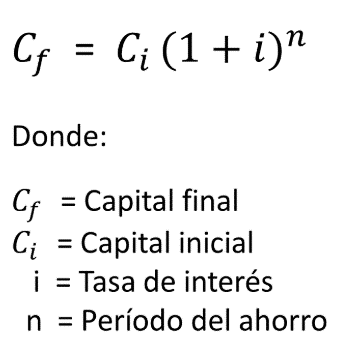

# Proyecto de Gestión Financiera para Estudiantes Universitarios

## Información del Proyecto

- **Nombre del Proyecto:** DesignWiz: una herramienta mágica para diseñadores gráficos freelance.
- **Fecha de Inicio del Proyecto:** 04/10/2023
- **Equipo Responsable:** Natalia Cardoso

## Descripción del Proyecto
El proyecto es una plataforma de gestión integral diseñada para ayudar a freelancers de diseño gráfico a administrar sus proyectos de manera efectiva. La plataforma proporciona herramientas para gestionar proyectos, realizar un seguimiento financiero, generar presupuestos, facturación, comunicarse con los clientes y mantener un alto nivel de profesionalismo en sus operaciones. La plataforma incluye una interfaz de usuario intuitiva y amigable.
### Objetivo del Proyecto:

El objetivo principal del proyecto es proporcionar a los freelancers de diseño gráfico una herramienta sólida que les permita:
- Gestionar proyectos de manera eficiente y organizada.
- Realizar un seguimiento financiero detallado, incluyendo ingresos, gastos y ganancias.
- Generar presupuestos y facturas de manera automática.
- Comunicarse de manera efectiva con los clientes y mantener un registro de la correspondencia.
- Mejorar su profesionalismo y eficiencia en la gestión de proyectos.

### Requerimientos:

- [X] **Registro y Autenticación** – RF001
  - [X] Los usuarios deben poder registrarse con una dirección de correo electrónico y contraseña.
  - [ ] Debe existir un proceso de autenticación seguro para iniciar sesión
- [ ] **Gestión de Proyectos** - RF002
  - [ ] Los usuarios deben poder crear, editar y eliminar proyectos
  - [ ] Cada proyecto debe incluir campos para descripción, fechas de inicio y entrega, cliente asociado y archivos relacionados.
- [ ] **Seguimiento de Tiempo y Gastos a través de gráficos y tablas** - RF003
  - [ ] Los usuarios deben poder registrar las horas trabajadas en cada proyecto.
  - [ ] Deben poder agregar y categorizar gastos relacionados con proyectos.
- [ ] **Generador de Presupuestos y Facturación** - RF004
  - [ ] Los usuarios deben poder generar presupuestos basados en el tiempo registrado y los gastos.
  - [ ] Deben poder generar facturas a partir de los presupuestos y enviarlas a los clientes.
- [ ] **Análisis Financiero** - RF005
  - [ ] La plataforma debe proporcionar informes financieros que incluyan ingresos, gastos, ganancias y pérdidas.
- [ ] **Plantillas de Contrato y Propuesta** - RF006
  - [ ] Los usuarios deben tener acceso a plantillas de contrato y propuesta.
  - [ ] Deben poder personalizar estas plantillas según las necesidades de cada proyecto.
- [ ] **Notificaciones y Recordatorios:** - RF007
  - [ ] Los usuarios deben recibir notificaciones y recordatorios de fechas de entrega, pagos pendientes y otras tareas importantes.
  
### Requerimientos No Funcionales:
- [ ] **Seguridad** - RF008
- [ ] **Usabilidad** - RF009
- [ ] **Rendimiento** - RF010
- [ ] **Cumplimiento Legal** - RF010
- [ ] **Documentación** - RF010

## Módulos

### Planeación Presupuestal:

- [ ] **Selección de mes y asignación de presupuestos para categorías específicas (por ejemplo, diseño gráfico, herramientas, oficina, entre otros).**.

### Registro de Ingresos y Gastos:

- [ ] **Selección de categoría (diseño gráfico, herramientas, oficina, etc.) y opción para registrar ingresos o gastos.**.

### Administración de Tus Categorías:

- [ ] **Añadir categorías personalizadas para necesidades específicas de diseñadores gráficos**.
- [ ] **Deshabilitar categorías según las necesidades cambiantes**.
- [ ] **Visualizar todas las categorías para un mejor control financiero**.

### Calculadora de Interés Compuesto:

- **Cálculo de ahorro estudiantil con tasa de interés del 6%**.
- **Definir el período de ahorro en meses**.
- 
### Informes Financieros Personalizados:
-  que permita a los usuarios crear y personalizar informes financieros según sus necesidades.
-  
### Dashboard:

- [ ] **Visualización de movimientos por mes en una tabla**.
- [ ] **Gráficos interactivos que presentan ingresos y gastos por categoría**.
- [ ] **Información sobre el balance de ingresos y gastos en el mes**.
- [ ] **Resumen de ahorros y progreso hacia objetivos financieros estudiantiles**.
- [ ] Seguimiento de Progreso del proyecto 
- [ ] Filtrado y Búsqueda
- [ ] Resumen de Tareas